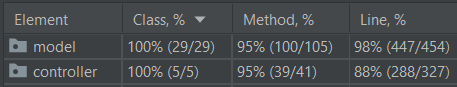

# Prova Finale di Ingegneria del Software - a.a. 2019-2020


The purpose of the project is to implement the board game [Santorini](https://roxley.com/products/santorini) following the architectural pattern Model View Controller for the realization of the model according to the object-oriented programming paradigm. The final result completely covers the rules defined by the game and allows you to interact with both a command line interface (CLI) and a graphical interface (GUI), the network has been managed with the traditional socket approach.

## Documentation
The following documentation includes the documents created for the design of the problem, the class diagrams in UML will be listed first then the code documentation (JavaDoc).

### UML
The following class diagrams represent the model according to which the game should have been implemented and the diagrams of the final product.
- [UML Initial](https://github.com/ToMmAzO/ing-sw-2020-Pozzi-Quagliana-Simeoni/tree/master/deliverables/uml/initial)
- [UML Final](https://github.com/ToMmAzO/ing-sw-2020-Pozzi-Quagliana-Simeoni/tree/master/deliverables/uml/final)

### JavaDoc
The following documentation includes a description for most of the classes and methods used, follows the Java documentation techniques and can be consulted at the following address: [JavaDoc](https://github.com/ToMmAzO/ing-sw-2020-Pozzi-Quagliana-Simeoni/tree/master/deliverables/JavaDoc)

### Test Coverage


### Librerie e Plugins
|Library/Plugin|Description|
|---------------|-----------|
|__maven__|management tool for software based on Java and build automation|
|__junit__|Java framework for unit testing|
|__Swing__|Java graphics library|

### Jars
The following jars allow the launch of the game as described in the introduction feature. The features built according to the design specification are listed in the next section while the details for how to launch the system will be defined in the section called __Execution of jar__. To allow the game to run correctly, you must first run the __server.jar__ and then the __client.jar__. The folder where the client and server software are located is at the following address: [Jars](https://github.com/ToMmAzO/ing-sw-2020-Pozzi-Quagliana-Simeoni/blob/master/deliverables/jar).

## Funzionalità
### Funzionalità Sviluppate
- Regole Complete
- CLI
- GUI
- Socket

### Funzionalità Aggiuntive Sviluppate
- Divinità Avanzate

## Execution of JAR
### Client
The client is run by choosing the interface to play with, the possible choices are from the command line or graphical interface. The following sections describe how to run the client in one way or another.

#### CLI
To launch the client in CLI mode, type the following command:
```
java -jar client.jar -ip [server_ip] -cli
```

#### GUI
To launch the client in GUI mode, type the following command:
```
java -jar client.jar -ip [server_ip] -gui
```

#### Parameters
- `-ip 127.0.0.1`: allows you to enter the IP address of the server to connect to, in the case shown 127.0.0.1;
- `-cli/-gui`: allows you to choose whether to play in cli / gui. If not specified the default value is __gui__;

### Server
To launch the server, type the following command:
```
java -jar server.jar
```

## Members of the group
- [__Tommaso Pozzi__](https://github.com/ToMmAzO)
- [__Luca Quagliana__](https://github.com/LucaQuagliana)
- [__Raffaele Simeoni__](https://github.com/RaffaeleSimeoni)
